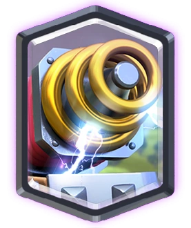

## Description

The goal of this project is to create a network game where several teams confront each other on a tile map containing resources.
The winning team is the first one where at least 6 players reach the maximum elevation.


## Documentation :

### Docusorus :
    To start the docusarus documentation :
    cd documentation/my-website
    npx docusaurus start

    Si erreur dans le lancement comme ici :

    `npm error could not determine executable to run`

    executer ça : `npm install --save-dev @docusaurus/types`


### Doxygen :
    The basic documentation fo the project is generated using the
    doxygen, to run the doxygen executable, please make sure you
    installed the pdf-latex librairie.
    To generate the PDF you need move the my-zappy-doc, folder out of the repositorie
    because the Unicode emojis used make the generation fails, then execute this :

    ./generateDoc.sh

    After that you can move back the folder in the documentation
    folder.

## Commit norm :

[Gitmoji] : [Element / Module] : [MESSAGE]

Gitmoji = The emoji approriate for the current modification.
[Element / Module] = The elemenet you applied the modification.
[MESSAGE] = A detail message of what you did.

Gitmojies:

    Code feature :
        - :sparkles: (✨): Introduce new features
        - :recycle: (♻️): Refactor / update code
        - :bug: (🐛): Fix a bug
        - :poop: (💩) : Remove Coding style or temporary fix
        - :rotating_light: (🚨) : Fix Compiling Warning
        - :fire: (🔥): Remove code or files

    Test feature :
        - :white_check_mark: (✅): Add, update, or pass tests

    Architecture :
        - :see_no_evil: (🙈): Add or update .gitignore files
        - :construction_worker: (👷): Add or update CI build system
        - :building_construction: (🏗️) : Make Architectural changes
        - :memo: (📝) : Add or update documentation

### Pull Request
    - :tada: (🎉): This Gitmoji must be used for each PR created!
    - :lipstick: (💄): This Gitmoji must be used for each PR merged!
    - :rewind: (⏪️): This Gitmoji must be used for each revert done!


## Git-Cli :

- Changer message de commit, avant qu'il soit push :
    ```bash
    git commit --amend -m "New commit message"
    ```

- Changer le message de commit, si il a deja été push :
    ```bash
    git commit --amend -m "New commit message"
    git push --force
    ```

- Un-add un ficher add par erreur qui est pas encore push:
    ```bash
    git restore --staged <file>
    ```

- Un-add un fichier qui a été commit :
    ```bash
    git reset --soft HEAD~1
    git restore --staged fichier-a-retirer.txt
    git commit -m "Nouveau message de commit (sans le fichier)"
    ```
